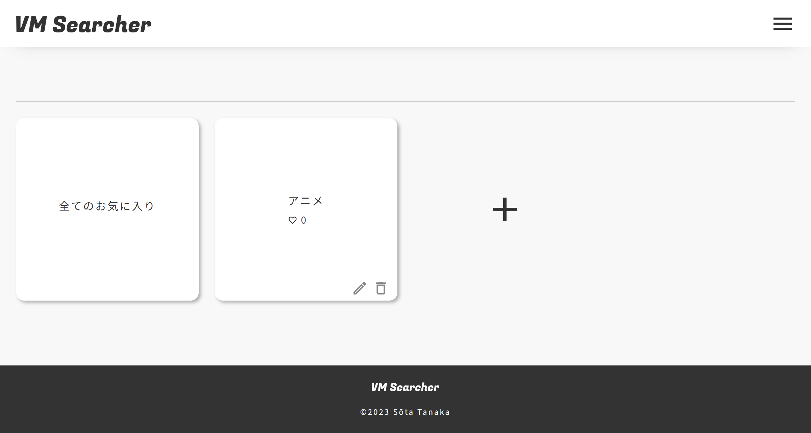
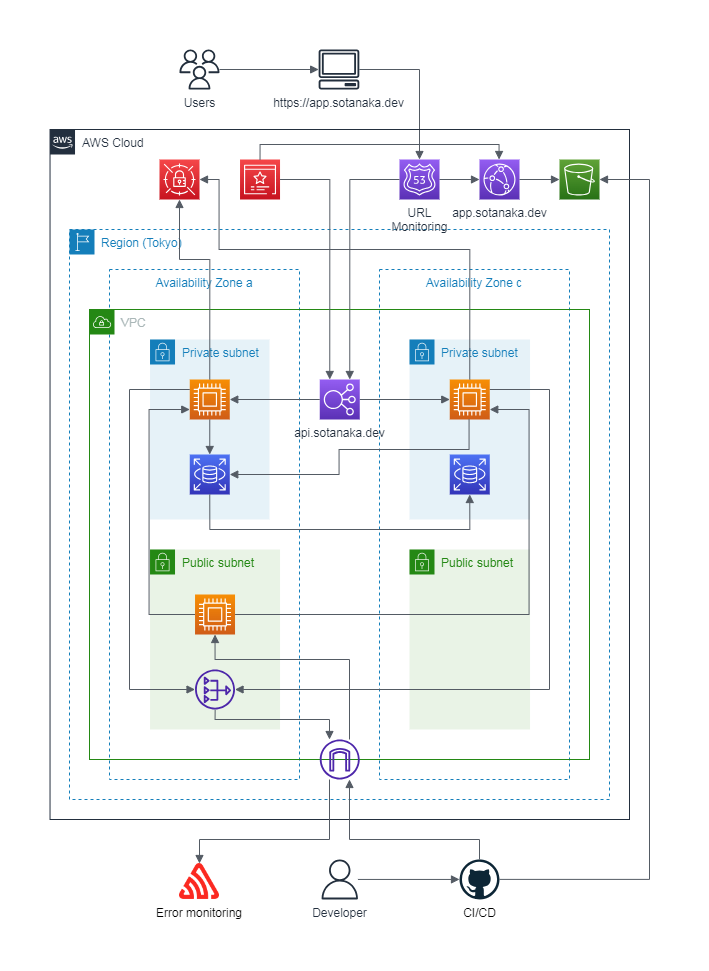

 

## コンセプト
VM Searcher（Visual Media Searcher）は、普段から画像・動画系のSNSをよく利用する人のための、いろいろなSNSの検索結果を1ヶ所で確認できるサービスです。

 

## 対象ユーザー
- 画像・動画系のSNSをよく利用する人
- ブラウザの代わりにSNS内検索をよく利用する人
- 見たい画像や動画にたどり着くまでに複数のSNSで検索をすることを面倒に感じている人

 

## サービスのURL
https://app.sotanaka.dev/

 

## 機能一覧
| トップ画面 | サインイン・サインアップ画面 |
| ---- | ---- |
|  |  |
| サインイン・サインアップ画面へのリンクを配置しています。 | ユーザー名とパスワードでサインイン・サインアップ可能です。 |

| 検索画面 | 検索結果 |
| ---- | ---- |
|  |  |
| キーワード検索を行います。 検索対象のSNS（YouTube、Flickr、GIPHY）の絞り込みも可能です。 ※ 検索ショートカット機能は今後追加予定です。  | 検索結果一覧です。 |

| 投稿詳細モーダル | フォルダ一覧画面 |
| ---- | ---- |
|  |  |
| SNSの投稿ページへのリンク、お気に入り登録・削除が可能です。 ※ ソーシャルシェア機能は今後追加予定です。 | お気に入りフォルダ一覧（ルート）です。 フォルダの追加と、各フォルダに対してフォルダ名の変更と削除が行えます。 ※ フォルダの移動・一括削除は今後追加予定です。 |

| 全てのお気に入り画面 | お気に入りを選択 |
| ---- | ---- |
|  |  |
| 追加したお気に入りはまずここに追加されます。 | お気に入りを選択して、フォルダに追加・お気に入りから削除を行えます。 各操作はモーダルから行います。 |

| 各フォルダ内画面 | マイページ画面 |
| ---- | ---- |
|  |  |
| フォルダに属するお気に入り一覧と、子フォルダが表示されます。 お気に入りを選択して、フォルダに追加・フォルダから削除・お気に入りから削除を行えます。 フォルダ内にはさらに子フォルダを作っていくことが可能です。 | ユーザー名・パスワードの変更、サインアウト、アカウント削除が行えます。 各操作はモーダルから行います。 |

 

## 使用技術

| カテゴリー        | 技術スタック                                         |
| ----------------- | --------------------------------------------------   |
| フロントエンド     | React (18.2.0), Sass (1.63.6)                        |
| バックエンド       | Ruby (3.2.2), Rails (7.0.6)                          |
| データベース       | MySQL (8.0.33)                                       |
| 開発環境構築       | Docker (20.10.23)                                    |
| インフラ構築       | AWS                                                  |
| CI/CD             | GitHub Actions                                       |
| 監視              | Sentry, Route53                                      |
| テスト・静的解析   | Minitest (5.18.1), RuboCop (1.54.1), ESLint (8.45.0) |

 

## システム構成図

 

## ER図

 

工夫した点
- 複数のSNSのAPIを使用
  - 形式の違う各SNSのレスポンスを、フロントエンドで扱いやすいように変換して一覧表示可能に
- Reactをはじめ、フロントエンドのライブラリを使用
  - SPAの実現等、UI/UXの向上
- CI/CD構築
  - デプロイの高速化と開発品質の向上
- セキュリティ
  - APIサーバー（EC2）とRDSをプライベートサブネットに配置し、NATゲートウェイと踏み台サーバーを介して通信
  - APIキー、RDSへの認証情報をAWS Secrets Managerで管理
  - JWTを使った認証

 

## 追加予定機能・課題
- パンくずリスト
- 検索履歴、閲覧履歴の管理
- フォルダの移動、一括削除機能
- 検索ショートカット機能（キーワードと1つ以上のSNSを登録 → ワンクリック検索）
- 検索結果のソーシャルシェア機能
- 現状SNSの数が少ない（YouTube、Flickr、GIPHYの3種類）ので、新しいSNSを追加
