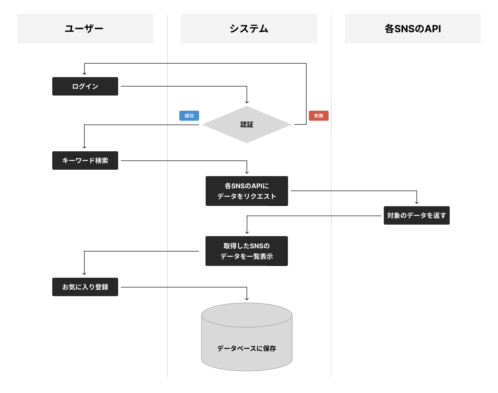
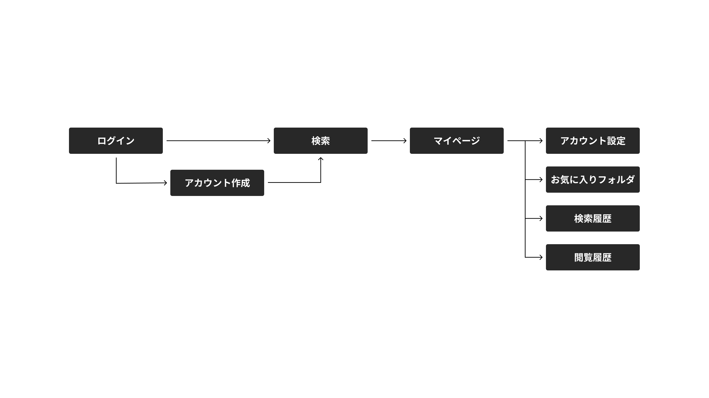
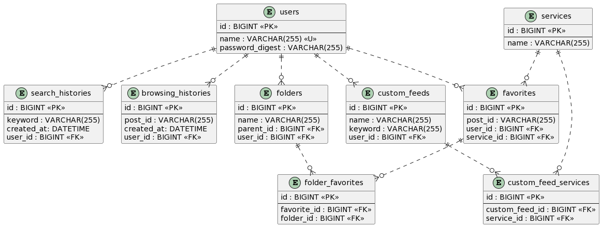
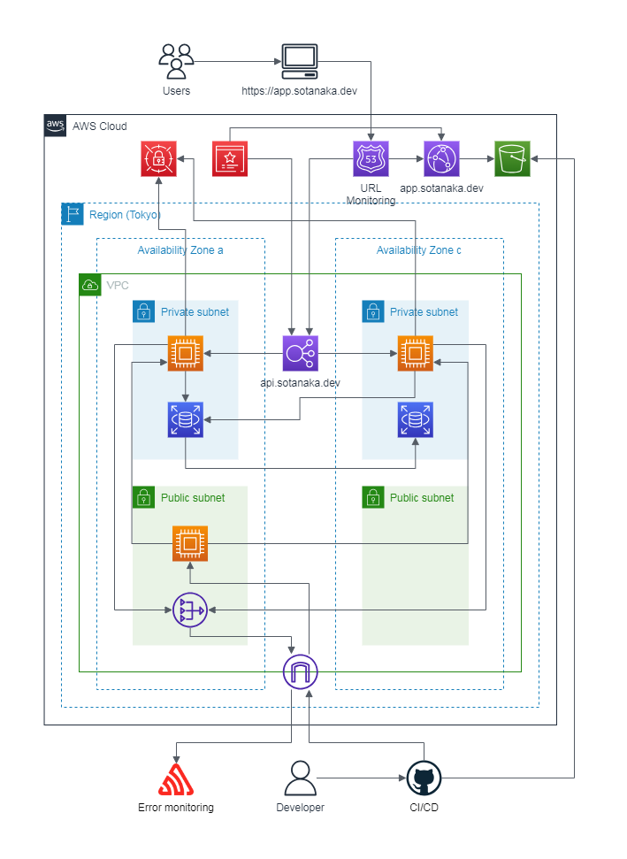

# Documents

  
<h2>要件定義</h2>

  # オリジナルプロダクトのテーマ

  ## 1. 一言サービスコンセプト
  SNS総合検索アプリ（画像・動画系）

  ## 2. 誰のどんな課題を解決するのか？
  ### 利用者
  - 母（50代）
  - 姉（30代）

  ### 普段使用するSNS
  - 画像・動画系のSNS

  ### SNSを使用する理由
  - ブラウザの検索でヒットする媒体は文字等の情報量が多いため、簡単に確認できる画像や動画系のSNSを日常的に使用

  ### SNSを使用する目的
  - 仕事、勉強、料理、趣味など、広い範囲での調べ事をするため

  ### 課題
  - 見たい画像や動画にたどり着くまでに複数のSNSで検索をすることが面倒なので、まとめて確認したい
  - 使ったことのないSNS内にも見たい情報があるかもしれないが、新しいSNSを使い始めるのは少しハードルが高い
  - 気に入った投稿をお気に入りとして登録し、フォルダに振り分けて管理したい
  - 自身の使用するSNSで検索結果の投稿に関する発信をしたい

  ## 3. なぜそれを解決したいのか？
  母と姉はプライベートから仕事までSNSを活用しており、ヒアリングしたところ上記のような悩みを持っていました。
  そして、私自身もSNSを用いて情報収集をすることがよくあり、自分も含めた家族のニーズに応えたいと思いました。

  ## 4. どうやって解決するのか？
  キーワードをもとに複数のSNSの検索結果をまとめて確認可能なアプリを開発して課題解決を実現したいと思います。

  ## 5. 機能要件
  - アカウント作成
  - ログイン/ログアウト
  - キーワード検索
  - 検索結果をタイムライン形式で一覧表示
  - 各SNSの取得順を変更可能（関連順、人気順、最新順）
  - 1つ以上のSNSを選択してフィルタリング
  - 1つ以上のSNSとキーワードを検索ショートカットとして登録
  - 検索結果をお気に入りとして管理
  - お気に入りをフォルダに振り分けて管理
  - 検索履歴/閲覧履歴の管理
  - 検索結果のソーシャルシェア
  - APIの利用制限に達したSNSを通知

  ## 6. 非機能要件
  - 保守性
    - GitHubにプッシュ時に静的解析で自動チェック
  - 運用性
    - GitHubのmainブランチにマージ後に自動デプロイ
  - 性能
    - 検索によるレスポンスの遅さを理由にユーザーが離脱しない範囲（2~3秒以内）
  - セキュリティ
    - HTTPSによるセキュアな通信
  - ユーザビリティ
    - SPAによるUXの向上
    - レスポンシブデザインでPCからスマホまで対応

  
<h2>業務フロー図</h2>

  

  
<h2>画面遷移図</h2>

  

  
<h2>ワイヤーフレーム</h2>

  

  
<h2>ER図</h2>

  

  
<h2>システム構成図</h2>

  

